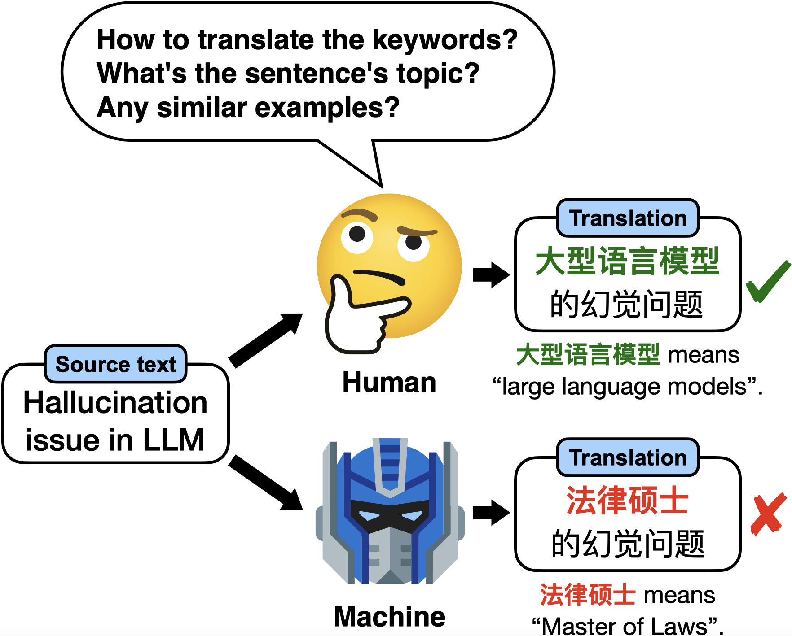
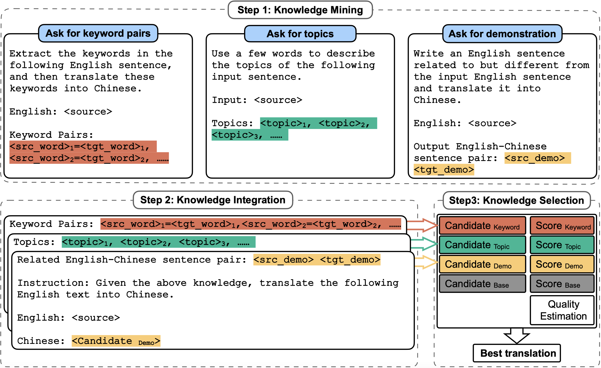

## 🗺️ MAPS: Multi-Aspect Prompting and Selection

Implementaion of our [paper](https://arxiv.org/abs/2305.04118):

```
Exploring Human-Like Translation Strategy with Large Language Models
```

## MAPS

**Motivation**

<p align="center">

</p>
The difference between machine and human translation in an English-Chinese example. Typical neural machine translation is a source-target mapping process, while human translators can take complex steps to ensure the quality and accuracy of the translation.

<br><br>

**MAPS Framework**

<p align="center">

</p>

MAPS aims to enable LLMs to mimic the human translation process by multi-aspect prompting and selection.

<br>

## Dependencies

* Download COMET and BLEURT checkpoints:

  ```shell
  wget https://unbabel-experimental-models.s3.amazonaws.com/comet/wmt21/wmt21-comet-qe-da.tar.gz
  tar -xf wmt21-comet-qe-da.tar.gz -C eval_ckpt/
  
  wget https://storage.googleapis.com/bleurt-oss-21/BLEURT-20.zip .
  unzip -d eval_ckpt/ BLEURT-20.zip
  ```
* Create conda env

  ```shell
  conda create -n maps -c pytorch -c nvidia python==3.8.13 krb5 git pytorch==2.0.0 pytorch-cuda=11.7
  ```
* Install other python packages

  ```
  pip3 install -r requirements.txt
  ```

<br>

## Run

**Preparation**

* Set your openai API_KEY in `model/openai/translate.py`
* Set Alpaca checkpoint file in `run-maps.sh` and `run-translation.sh`

**Run MAPS**

`sh run-maps.sh `

**Run other methods**

`sh run-translation.sh `

*Note: The translation results have already been generated and saved in the `output` directory. Therefore, the scripts won't repeat the inference. If you want to regenerate the results, simply delete the contents within the `output` directory.*

<br>

## Evaluation

`sh run-evaluation.sh > evaluation.log`


## Citaion

```ruby
@article{he2023exploring,
  title={Exploring Human-Like Translation Strategy with Large Language Models},
  author={He, Zhiwei and Liang, Tian and Jiao, Wenxiang and Zhang, Zhuosheng and Yang, Yujiu and Wang, Rui and Tu, Zhaopeng and Shi, Shuming and Wang, Xing},
  journal={arXiv preprint arXiv:2305.04118},
  year={2023}
}
```

